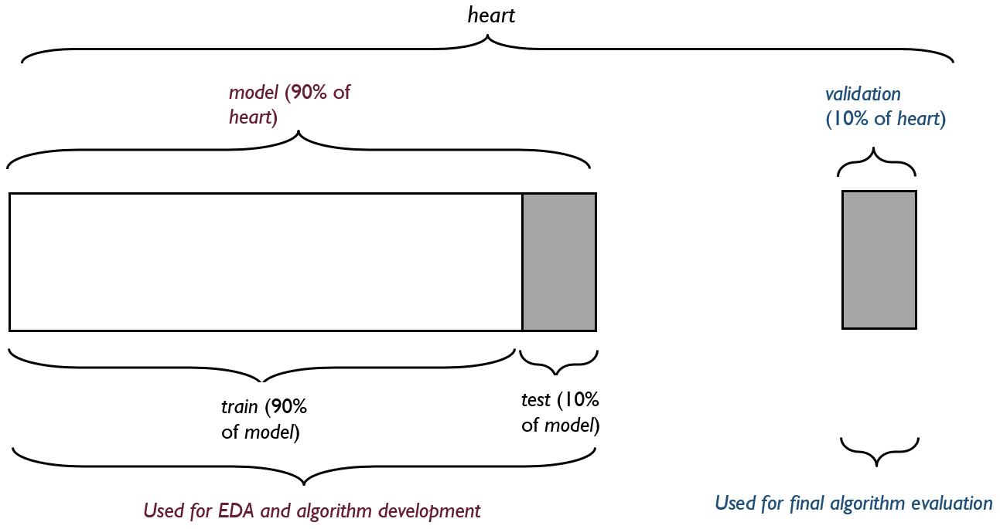

```{r setup, include = FALSE}

# Load setup
knitr::opts_chunk$set(
  echo = FALSE,
  message = FALSE,
  warning = FALSE,
  out.width = "95%")
```

```{r, Custom theme, color palette, include = FALSE}

###################################################################################
# Create custom plot theme for all plots in the report
###################################################################################

theme_1 <- function() {
  font <- "sans" # assign family font
  theme_classic() %+replace% # modify from base theme
    theme(
      plot.title = element_text(
        family = font,
        size = 10,
        face = "bold",
        hjust = 0,
        vjust = 2
      ),
      axis.title = element_text(
        family = font,
        size = 8
      ),
      axis.text = element_text(
        family = font,
        size = 7
      ),
      legend.position = "top",
      legend.key.size = unit(0.35, "cm"),
      legend.title = element_text(
        size = 8
      ),
      plot.caption = element_text(
        size = 6,
        hjust = 1
      )
    )
}
```

\newpage

# Introduction

## Cardiovascular and Heart Disease

Cardiovascular disease (CVD)[^1] is a term for all types of diseases affecting the heart or blood vessels, including coronary heart disease, stroke, congenital heart defects and peripheral artery disease [@NHLBI]. All heart diseases (HDs) are CVDs but not all CVDs are HDs. According to the World Health Organisation (WHO), CVDs are the leading cause of morbidity and mortality worldwide [@world2021cardiovascular]. In 2019, approximately 17.9 million people (32% of worldwide deaths) died from CVDs. Over 75% of these deaths occur in low- and middle-income countries, where there is inadequate access to effective and affordable primary health care that prevents early and accurate detection, diagnosis and timely intervention [@world2021cardiovascular].

[^1]: According to the [National Heart, Lung and Blood Institute](@https://www.nhlbi.nih.gov/sites/default/files/media/docs/Fact_Sheet_Know_Diff_Design.508_pdf.pdf) (NHLBI), the terms 'cardiovascular disease (CVD)', 'heart disease (HD)' and ' coronary heart disease' are often used interchangeably [@NHLBI]. The NHLBI, defines them as follows:

    -   CVD: A term for all types of diseases affecting the heart or blood vessels, including coronary heart disease, stroke, congenital heart defects and peripheral artery disease.
    -   HD: A catch-all phrase for a variety of conditions affecting the heart structure and function. The most common type of HD is coronary heart disease.
    -   Coronary heart disease: Build up of plaque in the arteries (atherosclerosis). It is another term for coronary artery disease and is one type of HD but not the only one.

Preventable risk factors for HDs and stroke include poor diet, lack of physical activity, ineffective use of alcohol and tobacco [@world2021cardiovascular; @fuchs2020high; @benjamin2018heart; @peters2019sex]. These manifest in the body as elevated blood pressure (BP), blood sugar (BS) and blood lipids, and overweight or obesity [@world2021cardiovascular].

### Machine Learning and Diagnosis of CVD

Machine learning (ML), a scientific discipline which uses computer algorithms that learn and adapt, can be exploited to diagnose a number of medical disorders [@sajda2006machine; @deo2015machine]. ML approaches include *supervised learning*, which entails using labeled data to train algorithms to classify data or predict outcomes, and *unsupervised learning*, which aims to identify naturally occurring patterns and trends or clusters data into groups using unlabelled data [@deo2015machine].

In the context of disease diagnosis, supervised learning entails training algorithms using data for which the disease status of patients is known and applying the trained algorithm to make predictions regarding the disease status of patients whose disease status is unknown [@akella2021machine].

Supervised learning models are categorised as:

-   *Classification models* - predict specific discrete or categorical values; or
-   *Regression models* - predict continuous numerical values.

## Data set Description

The [heart failure prediction data set](https://www.kaggle.com/datasets/fedesoriano/heart-failure-prediction%5D) [@fedesoriano2021] was created by combining the following 5 data sets from the [Heart Disease Data set directory of the UCI Machine Learning Repository](https://archive.ics.uci.edu/ml/datasets/Heart+Disease):

-   Cleveland Clinic Foundation - 303 observations
-   Hungarian Institute of Cardiology, Budapest - 294 observations
-   V.A. Medical Center, Long Beach, CA - 200 observations
-   University Hospital, Zurich, Switzerland - 123 observations
-   Statlog (Heart) data - 270 observations

Combined, these data sets resulted in a total of 1190 observations. The creator of the *heart* data set found and removed 272 duplicates, resulting in a data set of 918 observations and 12 variables. The codebook accompanying the data set defined the variables as follows:

-   [Outcome variable]{.underline}:

    i.  *HeartDisease*: output class (1: heart disease, 0: normal)

-   [Predictor variables]{.underline}:

    i.  *Age*: age of patient (years)
    ii. *Sex*: sex of the patient
        -   M: Male
        -   F: Female
    iii. *ChestPainType*: chest pain type
         -   TA: Typical Angina

         -   ATA: Atypical Angina

         -   NAP: Non-Anginal Pain

         -   ASY: Asymptomatic
    iv. *RestingBP*: resting blood pressure [mm Hg on admission to the hospital]
    v.  *Cholesterol*: serum cholesterol [mg/dL]
    vi. *FastingBS*: fasting blood sugar
        -   1: if FastingBS \> 120 mg/dl

        -   0: otherwise
    vii. *RestingECG*: resting electrocardiogram results
         -   Normal: Normal

         -   ST: having ST-T wave abnormality (T wave inversions and/or ST elevation or depression of \> 0.05 mV)

         -   LVH: showing probable or definite left ventricular hypertrophy by Estes' criteria]
    viii. *MaxHR*: maximum heart rate achieved [Numeric value between 60 and 202]
    ix. *ExerciseAngina*: exercise-induced angina
        -   Y: Yes

        -   N: No
    x.  *Oldpeak*: oldpeak = ST depression induced by exercise relative to rest [Numeric value measured in depression]
    xi. *ST_Slope*: the slope of the peak exercise ST segment
        -   Up: upsloping

        -   Flat: flat

        -   Down: downsloping


## Capstone Project

This report was created for the 'Choose Your Own' Project, the final of two Capstone projects required to fulfill the [HarvardX Data Science Professional Certificate series](https://learning.edx.org/course/course-v1:HarvardX+PH125.9x+1T2022/home). The stated aim of the project was to solve a problem of the student's choice using a publicly available data set and 2 ML algorithm techniques, with at least one algorithm that is more advanced than standard linear regression.

This project entailed a binary classification prediction project, which used the heart failure prediction data set, *heart*, to predict *presence* of HD in patients. For this project, the *heart* data set was first imported from [kaggle](https://www.kaggle.com/datasets/fedesoriano/heart-failure-prediction) and formatted. It was then divided into: i) a *model* data set, which contained 90% of *heart* data and was used for exploratory data analysis (EDA) and algorithm development; and ii) a *validation* data set, which contained 10% of *heart* data and was used as the final hold-out set to evaluate the final algorithm's performance. Data exploration and visualisation were conducted only on the *model* data set. Prior to algorithm development, the *model* data set was further divided into: i) a *train* data set, which contained 90% of *model* data and was used for model training and hyper-parameter tuning during algorithm development; and ii) a *test* data set, which was used for initial model evaluation during algorithm development.

Random forest (RF) and k-nearest neighbour (kNN) were the 2 ML algorithms selected for this project. Data pre-processing entailed kNN-imputation of improbable values for both the RF and kNN models and creation of dummy variables for categorical variables, and normalisation and skewness removal for continuous variables for the kNN model. Both models also utilized 10-fold cross-validation (of the *train* set) for hyper-parameter tuning. The best hyper-parameters for each model were chosen based on the performance metric, accuracy, and used to create the best RF and kNN models. The effectiveness of the 2 best models was then assessed by fitting them on the entire *train* data set and comparing their accuracy at predicting HD on the *test* data set. The model with the highest accuracy, the kNN model, achieved an accuracy of 0.78 and was chosen as the final algorithm. The RF model achieved an accuracy of 0.76. The final algorithm's performance on new data was finally assessed by fitting it on the entire *model* data set and evaluating it on the *validation* data set, resulting in an accuracy of 0.86.

The documents submitted for assessment of this project are: i) a report in R markdown format; ii) a report in PDF file format (knit from the Rmd file); iii) a script in R format; iv) the *heart* data set (heart.csv), and; v) file containing the list of citations used (citations-heart.bib).

### Acknowledgments

The creators of these data sets are:

-   Hungarian Institute of Cardiology. Budapest: Andras Janosi, M.D.
-   University Hospital, Zurich, Switzerland: William Steinbrunn, M.D.
-   University Hospital, Basel, Switzerland: Matthias Pfisterer, M.D.
-   V.A. Medical Center, Long Beach and Cleveland Clinic Foundation: Robert Detrano, M.D., Ph.D.

# Methods

## Data Import, Format and Overview

```{r, Download data set, include = FALSE}

# Install required packages
if (!require(tidyverse)) install.packages("tidyverse", repos = "http://cran.us.r-project.org")
if (!require(kableExtra)) install.packages("kableExtra", repos = "http://cran.us.r-project.org")
if (!require(skimr)) install.packages("skimr", repos = "http://cran.us.r-project.org")
if (!require(data.table)) install.packages("data.table", repos = "http://cran.us.r-project.org")
if (!require(scales)) install.packages("scales", repos = "http://cran.us.r-project.org")
if (!require(naniar)) install.packages("naniar", repos = "http://cran.us.r-project.org")
if (!require(ranger)) install.packages("ranger", repos = "http://cran.us.r-project.org")
if (!require(kknn)) install.packages("kknn", repos = "http://cran.us.r-project.org")
if (!require(workflows)) install.packages("workflows", repos = "http://cran.us.r-project.org")
if (!require(table1)) install.packages("table1", repos = "http://cran.us.r-project.org")
if (!require(grid)) install.packages("grid", repos = "http://cran.us.r-project.org")
if (!require(gridExtra)) install.packages("gridExtra", repos = "http://cran.us.r-project.org")
if (!require(ggpubr)) install.packages("ggpubr", repos = "http://cran.us.r-project.org")

library(tidyverse)
library(kableExtra)
library(skimr)
library(data.table)
library(scales)
library(naniar)
library(ranger)
library(kknn)
library(workflows)
library(table1)
library(grid)
library(gridExtra)
library(ggpubr)

# Download dataset from: https://www.kaggle.com/datasets/fedesoriano/heart-failure-prediction
# Save in working directory

# Load data
heart <- read_csv("heart.csv")

# Convert all variable names to lower case
colnames(heart) <- tolower(colnames(heart))
```

The [heart failure prediction data set](https://www.kaggle.com/datasets/fedesoriano/heart-failure-prediction) was imported into R and saved as *heart.* Table \@ref(tab:overview) shows an overview of the *heart* data set. It contained `r nrow(heart)` observations and `r ncol(heart)` variables---11 predictor variables and 1 outcome variable, *heartdisease*. The outcome variable indicated whether HD was *present* or *absent*. Table \@ref(tab:overview) also shows that *fastingbs* and *heartdisease* were classified as 'numeric' but should be of class 'factor'. The data set was re-formatted and all character variables were converted to class 'factor'.

```{r, overview}

# Create table showing classes and the first 10 observations
rbind(
  lapply(heart, class),
  head(heart, 10)
) %>%
  kbl(
    caption = "Overview of heart data set",
    booktabs = TRUE
  ) %>%
  kable_classic(
    latex_options = c("hold_position", "striped", "scale_down"),
    font_size = 8
  ) %>%
  row_spec(0, bold = TRUE) %>%
  pack_rows("Class", 1, 1) %>%
  pack_rows("First 10 observations", 2, 11)
```

```{r, formating}

# Convert fastingbs and heartdisease to class factor
heart <- heart %>%
  mutate(
    fastingbs = as.factor(fastingbs),
    heartdisease = as.factor(heartdisease)
  ) %>%
  # convert all age, restingbp, cholesterol and maxhr to integer
  mutate(
    age = as.integer(age),
    restingbp = as.integer(restingbp),
    cholesterol = as.integer(cholesterol),
    maxhr = as.integer(maxhr)
  ) %>%
  # convert oldpeak to double
  mutate(oldpeak = as.double(oldpeak)) %>%
  # convert all character variables to factor
  mutate(
    sex = as.factor(sex),
    chestpaintype = as.factor(chestpaintype),
    restingecg = as.factor(restingecg),
    exerciseangina = as.factor(exerciseangina),
    st_slope = as.factor(st_slope)
  )

# Attach value labels to heartdisease column
heart$heartdisease <- factor(heart$heartdisease,
  levels = c(0, 1),
  labels = c("Absent", "Present")
)

# Ensure that the first level of heartdisease is "present" - what is being predicted
heart$heartdisease <- ordered(heart$heartdisease, levels = c("Present", "Absent"))
```

Table \@ref(tab:data-structure) shows the structure of the *heart* data set after formatting, including all variable labels, names, classes, and levels, where available. Prior to data partitioning, the *heart* data set was checked for missing values and found to have none.

```{r, data-structure}

# Create table showing variablee, types, classes and levels if available
tibble(
  variable_label = c(
    "heartdisease",
    "age",
    "restingbp",
    "cholesterol",
    "maxhr",
    "oldpeak",
    "sex",
    "chestpaintype",
    "fastingbs",
    "restingecg",
    "exerciseangina",
    "st_slope"
  ),
  description = c(
    "Heart disease",
    "Age (in years)",
    "Resting blood pressure (in mmHg on admission to the hospital)",
    "Serum cholesterol (in mg/dL)",
    "Maximum heart rate achieved",
    "ST depression induced by exercise relative to rest",
    "Patient's gender",
    "Type of chest pain",
    "Fasting blood sugar",
    "Resting electrocardiographic results",
    "Exercise-induced angina",
    "Slope of the peak exercise ST segment"
  ),
  class = c(
    "Factor",
    "Numeric - integer",
    "Numeric - integer",
    "Numeric - integer",
    "Numeric - integer",
    "Numeric",
    "Factor",
    "Factor",
    "Factor",
    "Factor",
    "Factor",
    "Factor"
  ),
  levels = c(
    "0: Absent; 1: Present",
    "",
    "",
    "",
    "",
    "",
    "M: Male; F: Female",
    "TA: Typical angina; ATA: Atypical angina; NAP: Non-anginal pain; ASY: asymptomatic",
    "0: </= 120 mg/dL; 1: > 120 mg/dL",
    "Normal: normal; ST: having ST-T wave abnormality (T wave inversions and/or ST elevation or depression of > 0.05 mV);  LVH: showing probable or definite left ventricular hypertrophy by Estes' criteria",
    "Y: Yes; N: No",
    "Up: Upsloping; Flat: Flat; Down: Downsloping"
  )
) %>%
  kbl(
    caption = "Structure of heart data set",
    col.names = c(
      "Variable label",
      "Description",
      "Class",
      "Variable levels"
    ),
    booktabs = TRUE
  ) %>%
  kable_classic(
    latex_options = c("hold_position", "striped", "scale_down")
  ) %>%
  row_spec(0, bold = TRUE) %>%
  pack_rows("Outcome variable", 1, 1) %>%
  pack_rows("Predictor variables", 2, 12) %>%
  column_spec(4, width = "30em")
```

```{r, missing-values, fig.show = 'hide'}

# Check whether hearthas any missing values
gg_miss_var(heart) +
  theme_1() +
  labs(
    title = "Missing values in heartdata set",
    x = "variables",
    y = "Number or missing values"
  )
```

### Data Partitioning I: Creating *model* and *validation* Sets from *heart* Set

Before performing a more in-depth EDA, the *heart* data set was divided into 2 (Figure \@ref(fig:data-figure)):

i)  a *model* data set, which contained 90% of *heart* data and was used for EDA and algorithm development; and
ii) the *validation* data set, which contained 10% of *heart* data and was used as the final hold-out set to evaluate the final algorithm's performance.

```{r, create model and validation sets}

library(tidymodels)

# Create model (90% heart) and validation (10% heart) sets
# Set seed to allow reproducibility
set.seed(2000, sample.kind = "Rounding")

# Create an object contain the 90-10 split for model_new
heart_split <- heart %>%
  initial_split(
    prop = 0.9,
    strata = heartdisease
  )

# Extract model and validation sets
model <- training(heart_split)
validation <- testing(heart_split)
```

```{r, data-figure, fig.cap = "Data set partitions", out.width = "80%"}


```

The splitting was stratified using the outcome variable, *heartdisease,* to ensure that the the frequency distribution of the outcome in the new data sets was representative of the *heart* data set. Table \@ref(tab:data-sets-overview) shows the proportion of patients with and without HD in each data set. A second data partitioning, where the *model* data set was divided into the *train* and *test* data sets as shown in Figure \@ref(fig:data-figure), was done in the [Modeling Approach](#sec-modeling-approach) section.

```{r, data-sets-overview}

# Create table showing number of observations and proportions with and without heart disease for data sets from data partitioning I.
tibble(
  data_set = c(
    "Heart",
    "Model",
    "Validation"
  ),
  rows = c(
    nrow(heart),
    nrow(model),
    nrow(validation)
  ),
  heart_percent = c(
    paste0(nrow(heart) / nrow(heart) * 100, "%"),
    paste0(round(nrow(model) / nrow(heart) * 100, 1), "%"),
    paste0(round(nrow(validation) / nrow(heart) * 100, 1), "%")
  ),
  with_heartdisease = c(
    paste0(
      round(sum(heart$heartdisease == "Present") / nrow(heart) * 100, 1), "%"
    ),
    paste0(
      round(sum(model$heartdisease == "Present") / nrow(model) * 100, 1), "%"
    ),
    paste0(
      round(sum(validation$heartdisease == "Present") / nrow(validation) * 100, 1), "%"
    )
  ),
  no_heartdisease = c(
    paste0(
      round(sum(heart$heartdisease == "Absent") / nrow(heart) * 100, 1), "%"
    ),
    paste0(
      round(sum(model$heartdisease == "Absent") / nrow(model) * 100, 1), "%"
    ),
    paste0(
      round(sum(validation$heartdisease == "Absent") / nrow(validation) * 100, 1), "%"
    )
  )
) %>%
  kbl(
    caption = "Data partitioning I - Overview of data sets observations and proportions with and without heart disease",
    col.names = c(
      "Data set",
      "Number of observations",
      "Proportion of heart data set",
      "Proportion with HD",
      "Proportion without HD"
    ),
    booktabs = TRUE
  ) %>%
  kable_classic(
    latex_options = c("hold_position", "striped", "scale_down"),
    font_size = 8
  ) %>%
  row_spec(0, bold = TRUE)
```

## Data Cleaning, Exploration and Visualisation

Data exploration and visualisation was performed using only the *model* set.

### Outcome Variable

#### Heart Disease

```{r, heartdisease-summary}

# Number and percentage of patients with ('present') and without ('absent') heart disease
present_n <- model %>%
  filter(heartdisease == "Present") %>%
  count() %>%
  pull(n)

present_perc <- round(
  present_n / nrow(model) * 100,
  1
)

absent_n <- model %>%
  filter(heartdisease == "Absent") %>%
  count() %>%
  pull(n)

absent_perc <- round(
  absent_n / nrow(model) * 100,
  1
)
```

The *heartdisease* column contained the outcome variable, which indicated presence or absence of HD. Out of a total of 826 patients, HD was present in `r present_n` (`r paste0(present_perc, "%")`) and absent in `r absent_n` (`r paste0(absent_perc, "%")`) (Figure \@ref(fig:heartdisease)). This shows that the data set was balanced.

```{r, heartdisease, fig.cap = "Distribution of HD status", fig.height = 2.5, fig.width = 4}

# Compare number of patients with and without heart disease
model %>%
  ggplot(aes(heartdisease,
    fill = heartdisease
  )) +
  geom_bar(
    stat = "count",
    position = "stack",
    alpha = 0.9,
    show.legend = FALSE
  ) +
  geom_text(aes(label = ..count..),
    stat = "count",
    position = position_stack(vjust = 1.15),
    size = 2.5,
    color = "black"
  ) +
  geom_text(aes(label = paste0(
    "(",
    round(..count.. / nrow(model) * 100,
      digits = 1
    ), "%", ")"
  )),
  stat = "count",
  position = position_stack(vjust = 1.05),
  size = 2.5,
  color = "black",
  show.legend = FALSE
  ) +
  labs(
    caption = "Source: Heart failure prediction data set",
    x = "HD status",
    y = "Number of patients",
    fill = "HD status"
  ) +
  scale_fill_manual(values = c("#651D32", "#205493")) +
  theme_1()
```

Table \@ref(tab:descriptive-statistics) shows the descriptive statistics of all predictor variables stratified by HD status. HD appears to be associated with:

-   male gender,
-   asymptomatic chest pain,
-   fasting BS \> 120 mg/dL,
-   resting ECG results with ST-T wave abnormality and LVH,
-   presence of exercise-induced angina,
-   downsloping and flat slow of peak exercise ST segment (st_slope)
-   older age,
-   slightly higher resting BP,
-   lower serum cholesterol and maximum HR achieved, and
-   higher oldpeak (ST depression induced by exercise) values.

```{r, descriptive-statistics}

# Create table of descriptive statistics for all variables stratified by HD

# Create labels for categorical variables
# sex
model$sex <- factor(model$sex,
  levels = c(
    "F",
    "M"
  ),
  labels = c(
    "Female",
    "Male"
  )
)

# chestpaintype
model$chestpaintype <- factor(model$chestpaintype,
  levels = c(
    "TA",
    "ATA",
    "NAP",
    "ASY"
  ),
  labels = c(
    "Typical angina",
    "Atypical angina",
    "Non-anginal pain",
    "Asymptomatic"
  )
)

# fastingbs
model$fastingbs <- factor(model$fastingbs,
  levels = c(
    0,
    1
  ),
  labels = c(
    "</= 120 mg/dL",
    "> 120 mg/dL"
  )
)

# restingecg
model$restingecg <- factor(model$restingecg,
  levels = c(
    "ST",
    "LVH",
    "Normal"
  ),
  labels = c(
    "ST-T wave abnormality",
    "Left ventricular hypertrophy",
    "Normal"
  )
)

# exerciseangina
model$exerciseangina <- factor(model$exerciseangina,
  levels = c(
    "Y",
    "N"
  ),
  labels = c(
    "Yes",
    "No"
  )
)

# st_slope
model$st_slope <- factor(model$st_slope,
  levels = c(
    "Down",
    "Flat",
    "Up"
  ),
  labels = c(
    "Downsloping",
    "Flat",
    "Upsloping"
  )
)

# Re-label all variables
labels <- list(
  variables = list(
    sex = "Sex",
    chestpaintype = "Chest pain type",
    fastingbs = "Fasting blood sugar",
    restingecg = "Resting ECG",
    exerciseangina = "Exercise-induced angina",
    st_slope = "Slope of peak exercise ST segment (st_slope)",
    age = "Age (years)",
    restingbp = "Resting BP - Systolic (mmHg)",
    cholesterol = "Serum cholesterol (mg/dL)",
    maxhr = "Maximum HR achieved",
    oldpeak = "ST depression induced by exercise (oldpeak)"
  )
)

# Rearrange columns to have all patients first
strata <- c(
  list(Total = model),
  split(
    model,
    model$heartdisease
  )
)
# Create table
tab <- table1(
  strata,
  labels
)

# Finalize table
tab %>%
  kbl(
    caption = "Descriptive statistics table for the model data set",
    col.names = c(
      "",
      "All patients",
      "HD - Present",
      "HD - Absent"
    ),
    booktabs = TRUE
  ) %>%
  kable_classic(
    latex_options = c("hold_position", "striped"),
    font_size = 8
  ) %>%
  row_spec(0:1, bold = TRUE) %>%
  pack_rows("Categorical variables", 2, 23) %>%
  pack_rows("Continuous variables", 24, 38)
```

#### Data Cleaning

```{r, improbable-values}

# Number and percentage of patients in model data set with resting BP  of 0
zero_restingbp_n <- model %>%
  filter(restingbp == 0) %>%
  count()

zero_restingbp_perc <- round(
  zero_restingbp_n / nrow(model) * 100,
  1
)

# Number and percentage of patients in model data set with cholesterol  of 0
zero_chol_n <- model %>%
  filter(cholesterol == 0) %>%
  count()

zero_chol_perc <- round(
  zero_chol_n / nrow(model) * 100,
  1
)

# Number and percentage of patients in model data set with oldpeak values < 0
zero_oldpeak_n <- model %>%
  filter(oldpeak < 0) %>%
  count()

zero_oldpeak_perc <- round(
  zero_oldpeak_n / nrow(model) * 100,
  1
)
```

Table \@ref(tab:descriptive-statistics) revealed improbable values for some variables. Out of the `r nrow(model)` patients in the *model* data set, `r zero_chol_n` (`r paste0(zero_chol_perc, "%")`) had cholesterol levels of 0, `r zero_restingbp_n` (`r paste0(zero_restingbp_perc, "%")`) had resting BP levels of 0, and `r zero_oldpeak_n`(`r paste0(zero_oldpeak_perc, "%")`) had oldpeak values \< 0. kNN imputation was carried out on the *model* data set and the improbable values were imputed using the default number of neighbours (i.e., *k* = 5). Figure \@ref(fig:imputation-plots) shows plots before and after imputation and Table \@ref(tab:descriptive-statistics2) shows the descriptive statistics after imputation.

```{r, knn-imputation}

# Perform knn-imputation for resting BP and cholesterol levels of 0 and oldpeak values < 0

# Create new model object with all improbable values converted to NA
model1 <- model %>%
  # Convert all 0s in resting BP, cholesterol into NAs
  mutate(across(restingbp:cholesterol, ~ na_if(., 0))) %>%
  # Convert all negative values in oldpeak into NAs
  mutate(oldpeak = if_else(oldpeak < 0, as.numeric(NA), oldpeak))

library(recipes)

recipe_impute <- recipe(
  data = model1,
  heartdisease ~ .
) %>%
  # impute cholesterol values using knn-imputation
  step_impute_knn(
    cholesterol,
    restingbp,
    oldpeak
  )

# Visualize imputed data
model_imputed <- recipe_impute %>%
  prep(model1) %>%
  juice()
```

```{r, imputation-plots, fig.cap = "Scatter plots of cholesterol, resting BP and oldpeak values before and after kNN-imputation of the model data set", fig.height = 5, fig.width = 7}

# cholesterol
chol <- cbind(
  model$cholesterol,
  model_imputed$cholesterol
) %>%
  as.data.frame() %>%
  ggplot(aes(
    V1,
    V2
  )) +
  geom_point(
    color = "#205493"
  ) +
  geom_abline(aes(
    intercept = 0,
    slope = 1
  ),
  color = "#651D32"
  ) +
  labs(
    title = "Cholesterol (mg/dL)",
    x = "Before kNN-imputation",
    y = "After kNN-imputation"
  ) +
  scale_y_continuous(limits = c(0, 650)) +
  theme_1()

# restingBP
rest_bp <- cbind(
  model$restingbp,
  model_imputed$restingbp
) %>%
  as.data.frame() %>%
  ggplot(aes(
    V1,
    V2
  )) +
  geom_point(
    color = "#205493"
  ) +
  geom_abline(aes(
    intercept = 0,
    slope = 1
  ),
  color = "#651D32"
  ) +
  labs(
    title = "Resting BP (mm Hg)",
    x = "Before kNN-imputation",
    y = "After kNN-imputation"
  ) +
  scale_y_continuous(limits = c(0, 250)) +
  theme_1()

# oldpeak
oldpeak <- cbind(
  model$oldpeak,
  model_imputed$oldpeak
) %>%
  as.data.frame() %>%
  ggplot(aes(
    V1,
    V2
  )) +
  geom_point(
    color = "#205493"
  ) +
  geom_abline(aes(
    intercept = 0,
    slope = 1
  ),
  color = "#651D32"
  ) +
  labs(
    title = "Oldpeak",
    x = "Before kNN-imputation",
    y = "After kNN-imputation"
  ) +
  scale_y_continuous(limits = c(-2, 7)) +
  theme_1()

# Plot all graphs together
grid.arrange(
  arrangeGrob(chol,
    rest_bp,
    oldpeak,
    nrow = 2
  ),
  bottom = textGrob("Source: Heart failure prediction data set",
    hjust = 1,
    x = 1,
    gp = gpar(fontsize = 8)
  )
)
```

```{r, descriptive-statistics2}

# Descriptive statistics for the 3 variables modified using kNN-imputation
# Re-label all variables
labels <- list(
  variables = list(
    restingbp = "Resting BP - Systolic (mmHg)",
    cholesterol = "Serum cholesterol (mg/dL)",
    oldpeak = "ST depression induced by exercise (oldpeak)"
  )
)

# Rearrange columns to have all patients first
strata <- c(
  list(Total = model_imputed),
  split(
    model_imputed,
    model_imputed$heartdisease
  )
)
# Create table
tab1 <- table1(
  strata,
  labels
)

# Finalize table
tab1 %>%
  kbl(
    caption = "Descriptive statistics table for the model data set - kNN-imputed variables",
    col.names = c(
      "",
      "All patients",
      "HD - Present",
      "HD - Absent"
    ),
    booktabs = TRUE
  ) %>%
  kable_classic(
    latex_options = c("hold_position", "striped"),
    font_size = 8
  ) %>%
  row_spec(0:1, bold = TRUE)
```

The kNN-imputed *model* data set was used for the rest of the exploration and visualisation section.

```{r}

# Rename knn-imputed model set as model
model <- model_imputed
```

### Predictor Variables - Categorical

#### Sex

```{r, sex-summary}

# Sex counts
sex_n <- table(model$sex)

# Compute sex counts per HD category
sex_hd_n <- table(
  model$heartdisease,
  model$sex
)

# Compute proportions of sex with HD
sex_hd_prop <- sex_hd_n %>%
  # convert to percent
  proportions(2) * 100
```

The *sex* column contained the patient's gender. Studies show that CVD tends to primarily affect men, with largely higher rates being found in men compared to women in most age groups [@peters2019sex; @benjamin2018heart]. In our data, HD was observed to be more prevalent among males compared to females. Figure \@ref(fig:sex-cpt-HD)A shows that out of a total of `r sex_n["Male"]` males, `r sex_hd_n["Present","Male"]` (`r paste0(round(sex_hd_prop["Present", "Male"], 1), "%")`) were found to have HD compared to `r sex_hd_n["Absent","Male"]` (`r paste0(round(sex_hd_prop["Absent", "Male"], 1), "%")`) who did not. Out of a total of `r sex_n["Female"]` females, `r sex_hd_n["Present","Female"]` (`r paste0(round(sex_hd_prop["Present", "Female"], 1), "%")`) were found to have HD compared to `r sex_hd_n["Absent","Female"]` (`r paste0(round(sex_hd_prop["Absent", "Female"], 1), "%")`) who did not.

```{r, sex-HD}

# Distribution of heart disease by sex
sex_HD <- sex_hd_prop %>%
  as.data.frame() %>%
  mutate(Var2 = if_else(Var2 == "Female",
    paste0("Female \n Patients = ", sex_n["Female"]),
    paste0("Male \n Patients = ", sex_n["Male"])
  )) %>%
  ggplot(aes(
    x = Var2,
    y = Freq,
    fill = Var1
  )) +
  geom_col(
    position = position_dodge(width = 0.75),
    alpha = 0.9,
    show.legend = FALSE
  ) +
  geom_text(aes(label = paste0(
    round(Freq,
      digits = 1
    ),
    "%"
  )),
  position = position_dodge(width = 0.75),
  vjust = -0.9,
  size = 2
  ) +
  labs(
    title = "A. Sex",
    x = "",
    y = "Proportion of patients (%)",
    fill = "HD status"
  ) +
  scale_fill_manual(values = c("#651D32", "#205493")) +
  scale_y_continuous(limits = c(0, 85)) +
  theme_1()
```

#### Chest Pain Type

The phrase 'chest pain,' defined as "pain, pressure, tightness, or discomfort in the chest, shoulders, arms, neck, back, upper abdomen, or jaw, as well as shortness of breath and fatigue," is a common and recognizable symptom across various types of CVDs [@members20212021]. The *chestpaintype* column contained the patients' type of chest pain (also known as *angina pectoris*), which was categorised into 4 classes defined as follows [@detrano1984bayesian]:

-   [Typical angina]{.underline}: Pain that occurs in the anterior thorax, neck, shoulders, jaw, or arms is precipitated by exertion and relieved within 20 min by rest;

-   [Atypical angina]{.underline}: Pain in none of the above locations and either not precipitated by exertion or not relieved by rest within 20 min;

-   [Non-anginal pain]{.underline}: Pain not located in any of the above locations, or if so located not related to exertion, and lasting less than 10 sec or longer than 30 min;

-   [Asymptomatic]{.underline}: No pain.

```{r, cpt-summary}

# Counts per chestpaintype
cpt_n <- table(model$chestpaintype)

# Compute chestpaintype counts per HD category
cpt_hd_n <- table(
  model$heartdisease,
  model$chestpaintype
)

# Compute proportions of chestpaintype with HD
cpt_hd_prop <- cpt_hd_n %>%
  # convert to percent
  proportions(2) * 100
```

In our data set, HD was observed to be more prevalent among patients with asymptomatic chest pain compared to those with typical angina, non-anginal pain, and atypical angina. Figure \@ref(fig:sex-cpt-HD)B shows that out of a total of `r cpt_n["Asymptomatic"]` patients with asymptomatic chest pain type, `r cpt_hd_n["Present","Asymptomatic"]` (`r paste0(round(cpt_hd_prop["Present", "Asymptomatic"], 1), "%")`) had HD compared to `r cpt_hd_n["Absent","Asymptomatic"]` (`r paste0(round(cpt_hd_prop["Absent", "Asymptomatic"], 1), "%")`) without HD. Among `r cpt_n["Typical angina"]` patients with typical angina, `r cpt_hd_n["Present","Typical angina"]` (`r paste0(round(cpt_hd_prop["Present", "Typical angina"], 1), "%")`) had HD compared to `r cpt_hd_n["Absent","Typical angina"]` (`r paste0(round(cpt_hd_prop["Absent", "Typical angina"], 1), "%")`) who did not. Among `r cpt_n["Atypical angina"]` patients with atypical angina, `r cpt_hd_n["Present","Atypical angina"]` (`r paste0(round(cpt_hd_prop["Present", "Atypical angina"], 1), "%")`) had HD compared to `r cpt_hd_n["Absent","Atypical angina"]` (`r paste0(round(cpt_hd_prop["Absent", "Atypical angina"], 1), "%")`) who did not. Among `r cpt_n["Non-anginal pain"]` patients with non-anginal pain, `r cpt_hd_n["Present","Non-anginal pain"]` (`r paste0(round(cpt_hd_prop["Present", "Non-anginal pain"], 1), "%")`) had HD compared to `r cpt_hd_n["Absent","Non-anginal pain"]` (`r paste0(round(cpt_hd_prop["Absent", "Non-anginal pain"], 1), "%")`) who did not.

```{r, sex-cpt-HD, fig.cap= "Sex and chest pain type by HD status", fig.height = 3, fig.width = 8}

# Distribution of heart disease by chestpaintype
cpt_HD <- cpt_hd_prop %>%
  as.data.frame() %>%
  mutate(Var2 = case_when(
    Var2 == "Typical angina" ~
      paste0(
        "Typical angina \n Patients = ",
        cpt_n["Typical angina"]
      ),
    Var2 == "Atypical angina" ~
      paste0(
        "Atypical angina \n Patients = ",
        cpt_n["Atypical angina"]
      ),
    Var2 == "Non-anginal pain" ~
      paste0(
        "Non-anginal pain \n Patients = ",
        cpt_n["Non-anginal pain"]
      ),
    Var2 == "Asymptomatic" ~
      paste0(
        "Asymptomatic \n Patients = ",
        cpt_n["Asymptomatic"]
      )
  )) %>%
  ggplot(aes(
    x = Var2,
    y = Freq,
    fill = Var1
  )) +
  geom_col(
    position = position_dodge(width = 0.75),
    alpha = 0.9
  ) +
  geom_text(aes(label = paste0(
    round(Freq,
      digits = 1
    ),
    "%"
  )),
  position = position_dodge(width = 0.75),
  vjust = -0.9,
  size = 2
  ) +
  labs(
    title = "B. Chest pain type",
    x = "",
    y = "Proportion of patients (%)",
    fill = "HD status"
  ) +
  scale_fill_manual(values = c("#651D32", "#205493")) +
  scale_y_continuous(limits = c(0, 90)) +
  theme_1()

# Plot sex and chestpaintype graphs side by side
# legend
leg <- get_legend(cpt_HD)

# Plot on one graph
grid.arrange(
  arrangeGrob(nullGrob(), leg, nullGrob(), nrow = 1),
  arrangeGrob(sex_HD, cpt_HD + theme(legend.position = "none"),
    nrow = 1
  ),
  # ncol = 1,
  heights = c(0.5, 4),
  bottom = textGrob("Source: Heart failure prediction data set",
    hjust = 1,
    x = 1,
    gp = gpar(fontsize = 6)
  )
)
```

#### Fasting Blood Sugar

Diabetes Mellitus (DM) is a significant risk factor for CVD [@benjamin2018heart]. Fasting blood sugar (BS), or fasting blood glucose, levels are used to classify patients with DM. The American Heart Association (AHA) defines DM diagnosis as shown in Table \@ref(tab:FBS-classification) [@FBS]. The *fastingbs* column in the *heart* data contained patients' fasting BS levels as a categorical variable, with patients classified as having fasting BS levels $\leq$ 120 mg/dL or \> 120 mg/dL.

```{r, FBS-classification}

# Create table showing classification of fasting BS
tibble(
  FBS = c(
    "< 100 mg/dL",
    "100-125 mg/dL",
    "> / = 125 mg/dL"
  ),
  category = c(
    "Normal",
    "Prediabetes (impaired fasting glucose)",
    "Type 2 DM"
  ),
  meaning = c(
    "Healthy range",
    "At increased risk of developing diabetes",
    "At increased risk of heart disease or stroke"
  )
) %>%
  kbl(
    caption = "Categories of FBS in adults",
    col.names = c(
      "Fasting BS Category",
      "Diagnosis",
      "Interpretation"
    ),
    booktabs = TRUE
  ) %>%
  kable_classic(
    latex_options = c("hold_position", "striped"),
    font_size = 8
  ) %>%
  row_spec(0, bold = TRUE)
```

```{r, fastingbs-summary}

# Fastingbs counts
fbs_n <- table(model$fastingbs)

# Compute fastingbs counts per HD category
fbs_hd_n <- table(
  model$heartdisease,
  model$fastingbs
)

# Compute proportions of fastingbs with HD
fbs_hd_prop <- fbs_hd_n %>%
  # convert to percent
  proportions(2) * 100
```

In our data, HD was observed to be more prevalent among patients with fasting BS \> 120 mg/dL (i.e., patients with Type 2 DM and those at the upper end of the pre-diabetes category) compared to patients with $\leq$ 120 mg/dL (i.e., patients with normal levels of fasting BS and those on the lower end of the pre-diabetes range). Figure \@ref(fig:FBS-restECG-HD)A shows that among `r fbs_n["> 120 mg/dL"]` patients with fasting BS \> 120 mg/dL, `r fbs_hd_n["Present","> 120 mg/dL"]` (`r paste0(round(fbs_hd_prop["Present","> 120 mg/dL"], 1), "%")`) had HD compared to `r fbs_hd_n["Absent","> 120 mg/dL"]` (`r paste0(round(fbs_hd_prop["Absent","> 120 mg/dL"], 1), "%")`) who did not. Among `r fbs_n["</= 120 mg/dL"]` patients with fasting BS $\leq$ 120 mg/dL, `r fbs_hd_n["Present","</= 120 mg/dL"]` (`r paste0(round(fbs_hd_prop["Present","</= 120 mg/dL"], 1), "%")`) had HD compared to `r fbs_hd_n["Absent","</= 120 mg/dL"]` (`r paste0(round(fbs_hd_prop["Absent","</= 120 mg/dL"], 1), "%")`) who did not.

```{r, FBS-HD}

# Distribution of heart disease by fastingbs
FBS_HD <- fbs_hd_prop %>%
  as.data.frame() %>%
  mutate(Var2 = if_else(Var2 == "</= 120 mg/dL",
    paste0(
      "</= 120 mg/dL \n Patients = ",
      fbs_n["</= 120 mg/dL"]
    ),
    paste0(
      "> 120 mg/dL \n Patients = ",
      fbs_n["> 120 mg/dL"]
    )
  )) %>%
  ggplot(aes(
    x = Var2,
    y = Freq,
    fill = Var1
  )) +
  geom_col(
    position = position_dodge(width = 0.75),
    alpha = 0.9,
    show.legend = FALSE
  ) +
  geom_text(aes(label = paste0(
    round(Freq,
      digits = 1
    ),
    "%"
  )),
  position = position_dodge(width = 0.75),
  vjust = -0.9,
  size = 2
  ) +
  labs(
    title = "A. Fasting blood sugar",
    x = "",
    y = "Proportion of patients (%)",
    fill = "HD status"
  ) +
  scale_fill_manual(values = c("#651D32", "#205493")) +
  scale_y_continuous(limits = c(0, 85)) +
  theme_1()
```

#### Resting Electrocardiogram

Resting electrocardiogram (ECG) is a test that records electrical cardiac activity of a person at rest [@curry2018screening]. It is a non-invasive tool for screening and diagnosing HD [@larsen2002prevalence]. Abnormal resting ECG results, such as ST-segment or T-wave abnormalities and left ventricular hypertrophy (LVH), are associated with increased risk of CVDs [@chou2011screening]. The *restingECG* column of the *heart* data contained patients' resting ECG results categorised as:

-   [Normal]{.underline}: Normal ECG;
-   [ST]{.underline}: ST-T wave abnormality (T wave inversions and/or ST elevation or depression of \> 0.05 mV);
-   [LVH]{.underline}: Probable or definite LVH by Estes' criteria.

```{r, restingecg-summary}

# restingecg counts
restingecg_n <- table(model$restingecg)

# Compute fastingbs counts per HD category
restingecg_hd_n <- table(
  model$heartdisease,
  model$restingecg
)

# Compute proportions of restingecg with HD
restingecg_hd_prop <- restingecg_hd_n %>%
  # convert to percent
  proportions(2) * 100
```

In our data, HD was observed to be more prevalent among patients with ST-T wave abnormalities and LVH compared to patients with normal resting ECG results. Figure \@ref(fig:FBS-restECG-HD)B shows that among `r restingecg_n["ST-T wave abnormality"]` patients with ST-T wave abnormalities, `r restingecg_hd_n["Present","ST-T wave abnormality"]` (`r paste0(round(restingecg_hd_prop["Present","ST-T wave abnormality"], 1), "%")`) had HD compared to `r restingecg_hd_n["Absent","ST-T wave abnormality"]` (`r paste0(round(restingecg_hd_prop["Absent","ST-T wave abnormality"], 1), "%")`) who did not. Among `r restingecg_n["Left ventricular hypertrophy"]` patients with probable or definite LVH, `r restingecg_hd_n["Present","Left ventricular hypertrophy"]` (`r paste0(round(restingecg_hd_prop["Present","Left ventricular hypertrophy"], 1), "%")`) had HD compared to `r restingecg_hd_n["Absent","Left ventricular hypertrophy"]` (`r paste0(round(restingecg_hd_prop["Absent","Left ventricular hypertrophy"], 1), "%")`) who did not. Among `r restingecg_n["Normal"]` patients with normal ECG results, `r restingecg_hd_n["Present","Normal"]` (`r paste0(round(restingecg_hd_prop["Present","Normal"], 1), "%")`) had HD compared to `r restingecg_hd_n["Absent","Normal"]` (`r paste0(round(restingecg_hd_prop["Absent","Normal"], 1), "%")`) who did not.

```{r, FBS-restECG-HD, fig.cap= "Fasting blood sugar and resting ECG by HD status",  fig.height = 3, fig.width = 8}

# Distribution of restingecg heart disease
restECG_HD <- restingecg_hd_prop %>%
  as.data.frame() %>%
  mutate(Var2 = case_when(
    Var2 == "ST-T wave abnormality" ~
      paste0(
        "ST-T wave abnormality \n Patients = ",
        restingecg_n["ST-T wave abnormality"]
      ),
    Var2 == "Left ventricular hypertrophy" ~
      paste0(
        "Left ventricular hypertrophy \n Patients = ",
        restingecg_n["Left ventricular hypertrophy"]
      ),
    Var2 == "Normal" ~
      paste0(
        "Normal \n Patients = ",
        restingecg_n["Normal"]
      )
  )) %>%
  ggplot(aes(
    x = Var2,
    y = Freq,
    fill = Var1
  )) +
  geom_col(
    position = position_dodge(width = 0.75),
    alpha = 0.9
  ) +
  geom_text(aes(label = paste0(
    round(Freq,
      digits = 1
    ),
    "%"
  )),
  position = position_dodge(width = 0.75),
  vjust = -0.9,
  size = 2
  ) +
  labs(
    title = "B. Resting ECG",
    x = "",
    y = "Proportion of patients (%)",
    fill = "HD status"
  ) +
  scale_fill_manual(values = c("#651D32", "#205493")) +
  scale_y_continuous(limits = c(0, 70)) +
  theme_1()

# Plot fasting bs and resting ECG graphs side by side
# legend
leg <- get_legend(restECG_HD)

# Plot on one graph
grid.arrange(
  arrangeGrob(nullGrob(), leg, nullGrob(), nrow = 1),
  arrangeGrob(FBS_HD, restECG_HD + theme(legend.position = "none"),
    nrow = 1
  ),
  # ncol = 1,
  heights = c(0.5, 4),
  bottom = textGrob("Source: Heart failure prediction data set",
    hjust = 1,
    x = 1,
    gp = gpar(fontsize = 6)
  )
)
```

#### Exercise-induced Angina

Although frequent exercise has been linked with fewer coronary HD events, vigorous physical activity can result in increased risk of heart attacks in vulnerable people [@american2007exercise]. Exercise ECG is a test that records electrical cardiac activity during physical activity, such as on a treadmill or a bicycle, usually at a specific exercise intensity [@curry2018screening]. Exercise-induced angina is chest pain brought on by stress from exercise [@hlatky1999exercise]. The *exerciseangina* column of the *heart* data categorised patients into 2 categories: patients with and without exercise-induced angina based on the results of exercise ECG.

```{r, exerciseangina-summary}

# exerciseangina  counts
exang_n <- table(model$exerciseangina)

# Compute exerciseangina counts per HD category
exang_hd_n <- table(
  model$heartdisease,
  model$exerciseangina
)

# Compute proportions of exerciseangina with HD
exang_hd_prop <- exang_hd_n %>%
  # convert to percent
  proportions(2) * 100
```

In our data, HD was observed to be more prevalent among patients with exercise-induced angina compared to patients without it. Figure \@ref(fig:exang-ST-HD)A shows that among `r exang_n["Yes"]` patients with exercise-induced angina, `r exang_hd_n["Present","Yes"]` (`r paste0(round(exang_hd_prop["Present","Yes"], 1), "%")`) had HD compared to `r exang_hd_n["Absent","Yes"]` (`r paste0(round(exang_hd_prop["Absent","Yes"], 1), "%")`) without. Among the `r exang_n["No"]` patients without exercise-induced angina, `r exang_hd_n["Present","No"]` (`r paste0(round(exang_hd_prop["Present","No"], 1), "%")`) had HD compared to `r exang_hd_n["Absent","No"]` (`r paste0(round(exang_hd_prop["Absent","No"], 1), "%")`).

```{r, exang-HD}

# Distribution of heart disease by exerciseangina
exang_HD <- exang_hd_prop %>%
  as.data.frame() %>%
  mutate(Var2 = if_else(Var2 == "Yes",
    paste0("Yes \n Patients = ", exang_n["Yes"]),
    paste0("No \n Patients = ", exang_n["No"])
  )) %>%
  ggplot(aes(
    x = Var2,
    y = Freq,
    fill = Var1
  )) +
  geom_col(
    position = position_dodge(width = 0.75),
    alpha = 0.9,
    show.legend = FALSE
  ) +
  geom_text(aes(label = paste0(
    round(Freq,
      digits = 1
    ),
    "%"
  )),
  position = position_dodge(width = 0.75),
  vjust = -0.9,
  size = 2
  ) +
  labs(
    title = "A. Exercise-induced angina",
    x = "",
    y = "Proportion of patients (%)",
    fill = "HD status"
  ) +
  scale_fill_manual(values = c("#651D32", "#205493")) +
  scale_y_continuous(limits = c(0, 90)) +
  theme_1()
```

#### Slope of the Peak Exercise-induced ST-segment Depression (ST Slope)

```{r, st_slope-summary}

# st_slope  counts
stslope_n <- table(model$st_slope)

# Compute st_slope counts per HD category
stslope_hd_n <- table(
  model$heartdisease,
  model$st_slope
)

# Compute proportions of exerciseangina with HD
stslope_hd_prop <- stslope_hd_n %>%
  # convert to percent
  proportions(2) * 100
```

Abnormal exercise ECG results entail changes in the ST segment slope, such as elevations and depressions and have been linked to HD [@lim2016st]. The *st_slope* column of the *heart* data contained the patients' slope of the peak exercise ST segment categorised as upsloping, flat, or downsloping, based on exercise ECG results. In our data, HD was observed to be more prevalent among patients with downsloping and flat exercise-induced ST-segment depression slopes. Figure \@ref(fig:exang-ST-HD)B shows that among `r stslope_n["Flat"]` patients with flat ST-segment depression slopes, `r stslope_hd_n["Present", "Flat"]` (`r paste0(round(stslope_hd_prop["Present", "Flat"], 1), "%")`) had HD compared to `r stslope_hd_n["Absent","Flat"]` (`r paste0(round(stslope_hd_prop["Absent","Flat"], 1), "%")`) who did not. Among `r stslope_n["Downsloping"]` patients with downsloping ST-segment depression slopes, `r stslope_hd_n["Present", "Downsloping"]` (`r paste0(round(stslope_hd_prop["Present", "Downsloping"], 1), "%")`) had HD compared to `r stslope_hd_n["Absent","Downsloping"]` (`r paste0(round(stslope_hd_prop["Absent","Downsloping"], 1), "%")`) who did not. Among `r stslope_n["Upsloping"]` patients with upsloping ST-segment depression slopes, `r stslope_hd_n["Present", "Upsloping"]` (`r paste0(round(stslope_hd_prop["Present", "Upsloping"], 1), "%")`) had HD compared to `r stslope_hd_n["Absent","Upsloping"]` (`r paste0(round(stslope_hd_prop["Absent","Upsloping"], 1), "%")`) who did not.

```{r, exang-ST-HD, fig.cap = "Exercise-induced angina and ST-segment slope by HD status", fig.height = 3, fig.width = 8}

# Distribution of heart disease by st_slope
ST_HD <- stslope_hd_prop %>%
  as.data.frame() %>%
  mutate(Var2 = case_when(
    Var2 == "Downsloping" ~
      paste0(
        "Downsloping \n Patients = ",
        stslope_n["Downsloping"]
      ),
    Var2 == "Flat" ~
      paste0(
        "Flat \n Patients = ",
        stslope_n["Flat"]
      ),
    Var2 == "Upsloping" ~
      paste0(
        "Upsloping \n Patients = ",
        stslope_n["Upsloping"]
      )
  )) %>%
  ggplot(aes(
    x = Var2,
    y = Freq,
    fill = Var1
  )) +
  geom_col(
    position = position_dodge(width = 0.75),
    alpha = 0.9
  ) +
  geom_text(aes(label = paste0(
    round(Freq,
      digits = 1
    ),
    "%"
  )),
  position = position_dodge(width = 0.75),
  vjust = -0.9,
  size = 2
  ) +
  labs(
    title = "B. ST-segment slope",
    x = "",
    y = "Percentage of patients",
    fill = "HD status"
  ) +
  scale_fill_manual(values = c("#651D32", "#205493")) +
  scale_y_continuous(limits = c(0, 90)) +
  theme_1()

# Plot exerciseangina and st_slope graphs side by side
# legend
leg <- get_legend(ST_HD)

# Plot on one graph
grid.arrange(
  arrangeGrob(nullGrob(), leg, nullGrob(), nrow = 1),
  arrangeGrob(exang_HD, ST_HD + theme(legend.position = "none"),
    nrow = 1
  ),
  # ncol = 1,
  heights = c(0.5, 4),
  bottom = textGrob("Source: Heart failure prediction data set",
    hjust = 1,
    x = 1,
    gp = gpar(fontsize = 6)
  )
)
```

### Predictor Variables - Continuous

#### Age

```{r, age-summary}

# Compute age summary by HD
summ_age_HD <- model %>%
  group_by(heartdisease) %>%
  summarise(
    min = min(age),
    median = median(age),
    mean = mean(age),
    std_dev = sd(age),
    max = max(age)
  )
```

```{r, age-HD}

# Boxplots of age by HD
age_HD <- model %>%
  ggplot(aes(heartdisease, age,
    fill = heartdisease
  )) +
  geom_boxplot(
    alpha = 0.9,
    show.legend = FALSE
  ) +
  labs(
    title = "A. Age",
    x = "HD status",
    y = "Age (years)"
  ) +
  scale_fill_manual(values = c("#651D32", "#205493")) +
  theme_1()
```

Age is an essential determinant of heart health, with older age associated with increased risk of CVD [@north2012intersection]. The *age* column contained the age of each patient in years. Figure \@ref(fig:age-restingbp-HD)A shows that patients with HD tend to be older. Patients with HD have mean and median ages of `r summ_age_HD %>% filter(heartdisease == "Present") %>% pull(mean) %>% round(1)` and `r summ_age_HD %>% filter(heartdisease == "Present") %>% pull(median) %>% round(1)` years respectively, while those without HD have `r summ_age_HD %>% filter(heartdisease == "Absent") %>% pull(mean) %>% round(1)` and `r summ_age_HD %>% filter(heartdisease == "Absent") %>% pull(median) %>% round(1)` years, respectively (Table \@ref(tab:descriptive-statistics)).

#### Resting Blood Pressure

High BP is the leading preventable risk factor for CVD globally [@olsen2016call]. According to the 2017 American College of Cardiology (ACC) / American Heart Association (AHA) task force on clinical practice guidelines report, BP is classified as shown in Table \@ref(tab:BP-classification) [@whelton20182017].

```{r, BP-classification}

# Create table showing classification of BP
tibble(
  category = c(
    "Normal",
    "Elevated",
    "Hypertension - Stage I",
    "Hypertension - Stage II"
  ),
  SBP = c(
    "< 120 mm Hg",
    "120-129 mm Hg",
    "130-139 mm Hg",
    "> or = 140 mm Hg"
  ),
  x = c(
    "and",
    "and",
    "or",
    "or"
  ),
  DBP = c(
    "< 80 mm Hg",
    "< 80 mm Hg",
    "80-90 mm Hg",
    "> or = 90 mm Hg"
  )
) %>%
  kbl(
    caption = "Categories of BP in adults",
    col.names = c(
      "BP Category",
      "Systolic BP",
      "",
      "Diastolic BP"
    ),
    booktabs = TRUE
  ) %>%
  kable_classic(
    latex_options = c("hold_position", "striped"),
    font_size = 8
  ) %>%
  row_spec(0, bold = TRUE)
```

```{r, restingbp-summary}

# Compute restingBP summary by HD
summ_rbp_HD <- model %>%
  group_by(heartdisease) %>%
  summarise(
    min = min(restingbp),
    median = median(restingbp),
    mean = mean(restingbp),
    std_dev = sd(restingbp),
    max = max(restingbp)
  )
```

The *restingbp* column contained the resting BP of each patient in mm Hg, measured upon admission to hospital. It corresponded to the systolic BP in Table \@ref(tab:BP-classification). Figure \@ref(fig:age-restingbp-HD)B shows no clear difference in resting BP levels between patients with and without HD. Patients with HD have mean and median resting BP levels of `r summ_rbp_HD %>% filter(heartdisease == "Present") %>% pull(mean) %>% round(0)` and `r summ_rbp_HD %>% filter(heartdisease == "Present") %>% pull(median) %>% round(0)` mmHg respectively, while those without HD have `r summ_rbp_HD %>% filter(heartdisease == "Absent") %>% pull(mean) %>% round(0)` and `r summ_rbp_HD %>% filter(heartdisease == "Absent") %>% pull(median) %>% round(0)` mmHg, respectively (Table \@ref(tab:descriptive-statistics2)).

```{r, age-restingbp-HD, fig.cap = "Distribution of age and resting BP by HD status", fig.height = 2.5, fig.width = 8}

# Boxplots of restingbp by HD
restBP_HD <- model %>%
  ggplot(aes(heartdisease, restingbp,
    fill = heartdisease
  )) +
  geom_boxplot(
    alpha = 0.9,
    show.legend = FALSE
  ) +
  labs(
    title = "B. Resting blood pressure",
    x = "HD status",
    y = "Resting blood pressure (mmHg)"
  ) +
  scale_fill_manual(values = c("#651D32", "#205493")) +
  theme_1()

# Plot age and restingbp graphs side by side
grid.arrange(
  arrangeGrob(age_HD,
    restBP_HD,
    nrow = 1
  ),
  bottom = textGrob("Source: Heart failure prediction data set",
    hjust = 1,
    x = 1,
    gp = gpar(fontsize = 6)
  )
)
```

#### Serum Cholesterol

```{r, cholesterol-summary}

# Compute cholesterol summary by HD
summ_chol_HD <- model %>%
  group_by(heartdisease) %>%
  summarise(
    min = min(cholesterol),
    median = median(cholesterol),
    mean = mean(cholesterol),
    std_dev = sd(cholesterol),
    max = max(cholesterol)
  )
```

```{r, optimal-cholesterol}

# Create table showing optimal cholesterol levels
tibble(
  category = c(
    "Total cholesterol",
    "LDL (“bad”) cholesterol",
    "HDL (“good”) cholesterol",
    "Triglycerides"
  ),
  values = c(
    "About 150 mg/dL",
    "About 100 mg/dL",
    "At least 40 mg/dL in men and 50 mg/dL in women",
    "Less than 150 mg/dL"
  )
) %>%
  kbl(
    caption = "Optimal Cholesterol Levels",
    col.names = c(
      "Optimal Cholesterol Levels",
      ""
    ),
    booktabs = TRUE
  ) %>%
  kable_classic(
    latex_options = c("hold_position", "striped"),
    font_size = 8
  ) %>%
  row_spec(0, bold = TRUE)
```

Serum cholesterol, which contains "good" and "bad" cholesterol as well as triglycerises, is related to CVD [@grundy20192018]. Optimal cholesterol levels as defined as shown in Table \@ref(tab:optimal-cholesterol) [@grundy20192018]. The *cholesterol* column contained patients' serum cholesterol levels in mg/dL. It likely corresponds to total cholesterol in Table \@ref(tab:optimal-cholesterol). Figure \@ref(fig:chol-maxhr-HD)A shows no clear difference in serum cholesterol levels between patients with and without HD. Patients with HD have mean and median serum cholesterol levels of `r summ_chol_HD %>% filter(heartdisease == "Present") %>% pull(mean) %>% round(0)` and `r summ_chol_HD %>% filter(heartdisease == "Present") %>% pull(median) %>% round(0)` mg/dL respectively, while those without HD have `r summ_chol_HD %>% filter(heartdisease == "Absent") %>% pull(mean) %>% round(0)` and `r summ_chol_HD %>% filter(heartdisease == "Absent") %>% pull(median) %>% round(0)` mg/dL, respectively (Table \@ref(tab:descriptive-statistics2)).

```{r, cholesterol-HD}

# Boxplots of cholesterol by HD
chol_HD <- model %>%
  ggplot(aes(heartdisease, cholesterol,
    fill = heartdisease
  )) +
  geom_boxplot(
    alpha = 0.9,
    show.legend = FALSE
  ) +
  labs(
    title = "A. Serum cholesterol",
    x = "HD status",
    y = "Serum cholesterol (mg/dL)"
  ) +
  scale_fill_manual(values = c("#651D32", "#205493")) +
  theme_1()
```

#### Maximum Heart Rate

```{r, maxhr-summary}

# Create a summary table for maxhr by HD
summ_maxhr_HD <- model %>%
  group_by(heartdisease) %>%
  summarise(
    min = min(maxhr),
    median = median(maxhr),
    mean = mean(maxhr),
    std_dev = sd(maxhr),
    max = max(maxhr)
  )
```

The *maxhr* column contained the maximum heart rate (HR) achieved by patients following exercise ECG. Figure \@ref(fig:chol-maxhr-HD)B shows that patients with HD tend to achieve lower maximum HR levels. Patients with HD have mean and median maximum HR levels of `r summ_maxhr_HD %>% filter(heartdisease == "Present") %>% pull(mean) %>% round(0)` and `r summ_maxhr_HD %>% filter(heartdisease == "Present") %>% pull(median) %>% round(0)` respectively, while those without HD have `r summ_maxhr_HD %>% filter(heartdisease == "Absent") %>% pull(mean) %>% round(0)` and `r summ_maxhr_HD %>% filter(heartdisease == "Absent") %>% pull(median) %>% round(0)`, respectively (Table \@ref(tab:descriptive-statistics)).

```{r, chol-maxhr-HD, fig.cap = "Distribution of serum cholesterol and maximum HR by HD status", fig.height = 2.5, fig.width = 8}

# Boxplots of age by HD
maxhr_HD <- model %>%
  ggplot(aes(heartdisease, maxhr,
    fill = heartdisease
  )) +
  geom_boxplot(
    alpha = 0.9,
    show.legend = FALSE
  ) +
  labs(
    title = "B. Maximum heart rate",
    x = "HD status",
    y = "Maximum heart rate"
  ) +
  scale_fill_manual(values = c("#651D32", "#205493")) +
  theme_1()

# Plot cholesterol and maxhr graphs side by side
grid.arrange(
  arrangeGrob(chol_HD,
    maxhr_HD,
    nrow = 1
  ),
  bottom = textGrob("Source: Heart failure prediction data set",
    hjust = 1,
    x = 1,
    gp = gpar(fontsize = 6)
  )
)
```

#### ST Depression Induced by Exercise Relative to Rest (oldpeak)

```{r, oldpeak-summary}

# Create a summary table for oldpeak by HD
summ_oldpeak_HD <- model %>%
  group_by(heartdisease) %>%
  summarise(
    min = min(oldpeak),
    median = median(oldpeak),
    mean = mean(oldpeak),
    std_dev = sd(oldpeak),
    max = max(oldpeak)
  )
```

The *oldpeak* column contained patients' ST depression induced by an exercise ECG test relative to rest. Figure \@ref(fig:oldpeak-HD) shows that patients with HD tend to have higher oldpeak levels. Patients with HD have mean and median oldpeak levels of `r summ_oldpeak_HD %>% filter(heartdisease == "Present") %>% pull(mean) %>% round(1)` and `r summ_oldpeak_HD %>% filter(heartdisease == "Present") %>% pull(median) %>% round(1)`, respectively, while those without HD have `r summ_oldpeak_HD %>% filter(heartdisease == "Absent") %>% pull(mean) %>% round(1)` and `r summ_oldpeak_HD %>% filter(heartdisease == "Absent") %>% pull(median) %>% round(3)`, respectively.

```{r, oldpeak-HD, fig.cap = "Distribution of ST depression induced by exercise (oldpeak) by HD status", fig.height = 2.5, fig.width = 4}

# Boxplots of age by HD
model %>%
  ggplot(aes(heartdisease, oldpeak,
    fill = heartdisease
  )) +
  geom_boxplot(
    alpha = 0.9,
    show.legend = FALSE
  ) +
  labs(
    x = "HD status",
    y = "Oldpeak"
  ) +
  scale_fill_manual(values = c("#651D32", "#205493")) +
  theme_1()
```

### Insights Gained

The data set appears balanced, with HD present in 56.3% of patients and absent in 44.7% of patients. Compared to patients without HD, those with HD were more likely to be older, male, and have lower maximum HR, higher oldpeak values, asymptomatic chest pain type, fasting blood sugar levels greater than 120 mg/dL, abnormal resting ECG results (ST-T wave abnormalities and LVH), exercised-induced angina, and flat or downsloping ST-segment depression slope. No clear differences were observed for resting BP and serum cholesterol levels compared across HD status.

## Data Preparation

### Data Partitioning II

#### Creating *train* and *test* Sets

Before algorithm development, the imputed *model* data set was split into 2:

i)  the *train set*, which was used for training during algorithm development; and
ii) the *test set*, which was used for initial testing during algorithm development.

Splitting was stratified using the outcome variable, *heartdisease*.

```{r, Create train and test sets}

# Create train (90% of model) and test (10% of model) sets
# Set seed to allow reproducibility
set.seed(2000, sample.kind = "Rounding")

# Create an object contain the 90-10 split for model_new
model_split <- model %>%
  initial_split(
    prop = 0.9,
    strata = heartdisease
  )

# Extract train and test sets
train <- training(model_split)
test <- testing(model_split)
```

#### 10-fold Cross-validation

The *train* set was then used to create 10 cross-validation folds to be used in hyper-parameter tuning. Sampling was stratified using the outcome variable, *heartdisease*.

```{r, 10-fold cross-validation}

# Set seed to ensure reproducibility
set.seed(2000, sample.kind = "Rounding")

# Partition train set into 10 random equal splits
train_cv <- vfold_cv(train,
  strata = heartdisease,
  v = 10
)
```

## Modeling Approach {#sec-modeling-approach}

### Algorithm Development

The ML algorithms selected for this project were Random forest (RF) and k-nearest neighbour (kNN). The R package used for modeling was `tidymodels`. Given that the data set was balanced, the performance metrics used for model comparison was *accuracy*, i.e., the proportion of patients whose HD status was correctly predicted. The prediction of HD status was based on a threshold of 50%. The formula for calculating accuracy is:

$$
Accuracy = \frac{TP + TN}{TP + TN + FN + FP} = \frac{TP + TN}{P + N}
$$

where:

TP = true positives,

TN = true negatives,

FN = false negatives,

FP = false positives,

P = positives,

N = negatives.

#### Random Forest

RF is a supervised ML algorithm made up of an ensemble of *decision trees* whose results are averaged, resulting in an increased algorithm performance level and more stable predictions. RFs consist of 3 main hyper-parameters that need to be set prior to training data:

-   **trees**: number of trees contained in the ensemble;
-   **mtry**: maximum number of predictors randomly sampled at each split in the tree; and
-   **min_n**: minimum number of observations required for further splitting at a node.

RFs have 2 main advantages:

-   They are versatile and can be used for both classification and regression; and
-   When enough trees are used, RFs can overcome over-fitting,[^2] a common concern with decision trees. However, the use of too many trees is a disadvantage as it slows down computations.

[^2]: A model that over-fits is one that predicts well the data set used to train it but under-performs on the *test* set or any other new data set.

##### Variable Engineering

Variable engineering entails configuring variables into a format that makes it easier for the model selected to be applied. With `tidymodels`, this step is done using the function `recipe()`, which specifies the pre-processing steps to be carried out on the data set. For the RF model, variable engineering was limited to the kNN-imputation of all improbable values for all predictors that was done in the [data cleaning] section.

```{r, rf-recipe}

# Create a recipe for RF pre-processing
rf_recipe <- recipe(
  data = train,
  heartdisease ~ .
)

rf_recipe
```

##### Model Specification

Specification for the classification RF model was created using the function `rand_forest()` and the computational engine `ranger`. Tuning was specified for all 3 hyper-parameters: *trees*, *mtry* and *min_n*.

```{r, rf-model}

# Define random forest model
rf_model <- rand_forest(
  # specify number of trees to be used
  trees = tune(),
  # specify number of predictors randomly sampled at each tree split
  mtry = tune(), # parameter to be tuned
  # specify min number of data points in a node
  min_n = tune() # parameter to be tuned
) %>%
  # specify prediction outcome mode
  set_mode("classification") %>%
  # use 'ranger' engine for fitting and allow variable importance
  set_engine("ranger",
    importance = "impurity"
  )

rf_model
```

##### Workflow Specification

RF's pre-processing recipe and the RF model to be fit were combined in a `workflow` object.

```{r, rf-workflow}

# Create rf_workflow to aggregate all info to fit the model & generate predictions

rf_workflow <- workflow() %>%
  # add random forest model
  add_model(rf_model) %>%
  # add the train recipe
  add_recipe(rf_recipe)

rf_workflow
```

##### Hyper-parameter Tuning

```{r, rf-hyper-parameter-tuning}

# set seed for reproducibility
set.seed(2000)

# Tune rf hyper-parameters trees, mtry and min_n
rf_params <- rf_workflow %>%
  tune_grid(
    resamples = train_cv,
    metrics = metric_set(accuracy)
  )

# Show best accuracy from RF hyper-parameter tuning
best_rf_acc <- rf_params %>%
  show_best(n = 1) %>%
  pull(mean) %>%
  round(digits = 3)
```

Tuning was done using the function `tune_grid()` and the 10 cross-validations folds of the *train* set.[^3] The performance metric used to compare results from hyper-parameter tuning was accuracy. The highest accuracy achieved by RF hyper-parameter tuning was `r best_rf_acc`.

[^3]: As no tuning grid was specified, the function used an in-built default grid, consisting of a semi-random space-filling grid with 10 hyper-parameter combinations.

##### Best Model Selection

The hyper-parameters corresponding to the highest accuracy achieved by RF hyper-parameter tuning were used to create the best RF model. The RF workflow was then updated to reflect the best RF model.

```{r, best-rf-model}

# Select RF hyper-parameters with the highest accuracy
best_rf_params <- rf_params %>%
  select_best()

# Update rf_workflow with best rf parameters
rf_workflow <- rf_workflow %>%
  finalize_workflow(best_rf_params)

rf_workflow
```

##### Best Model Evaluation

The effectiveness of the best RF model was assessed by fitting it on the entire *train set* and evaluating on the *test* set using the function `last_fit()`. The results are shown in the [Results] section.

```{r, rf-last-fit}

# Fit best rf model on train set and evaluate on test set
rf_last_fit <- rf_workflow %>%
  last_fit(
    split = model_split,
    metrics = metric_set(accuracy)
  )
```

#### k-Nearest Neighbour

kNN is a simple, effective and commonly used ML algorithm. It allows classification of observations in a data set by comparing their attributes to attributes of "similar" labeled observations in the same data set [@bramer2013introduction]. The number of known observations to be used, *k*, needs to be set prior to training the model.

kNN's advantages include:

-   Ease of implementation, with only one main hyper-parameter, i.e., *k*, required to implement it
-   Speed: it is faster than other algorithms as it does not require a training period.

kNN's disadvantages include:

-   Issues with large or high deminsional data sets due to cost of distance calculation;
-   Requires variable scaling prior to applying algorithm;
-   Sensitive to noisy and missing data and outliers thus requires removal or imputation.

##### Variable Engineering

In addition to the kNN-imputation of improbable values done in the [Data Cleaning] section, the function `recipe()` was used to specify the pre-processing steps to be carried out on the data set. For the kNN model this entailed:

-   creation of dummy variables for all categorical predictors; and
-   normalisation and removal of skewness for all numeric predictors.

```{r, knn_recipe}

# Create a recipe for knn pre-processing
knn_recipe <- recipe(
  data = train,
  heartdisease ~ .
) %>%
  # remove skewness from all numeric predictors
  step_YeoJohnson(all_numeric_predictors()) %>%
  # normalise all numeric predictors (to std dev = 1 and mean = 0)
  step_normalize(all_numeric_predictors()) %>%
  # create dummy variables for all factors
  step_dummy(all_nominal_predictors())

knn_recipe
```

##### Model Specification

Specification for the classification kNN model was created using the function function `nearest_neighbor()` and the computational engine `kknn`. Tuning was specified for the kNN hyper-parameter, *neighbours (k)*.

```{r, knn-model}

# Define knn model
knn_model <- nearest_neighbor(
  # specify number of neighbours considered at each prediction
  neighbors = tune() # parameter to be tuned
) %>%
  # specify prediction outcome mode
  set_mode("classification") %>%
  # use 'kknn' engine for fitting
  set_engine("kknn")

knn_model
```

##### Workflow Specification

kNN's pre-processing recipe and the kNN model to be fit were combined in a `workflow` object.

```{r, knn-workflow}

# Create knn_workflow to aggregate all info to fit the model & make predictions
knn_workflow <- workflow() %>%
  # add the heart recipe
  add_recipe(knn_recipe) %>%
  # add knn model
  add_model(knn_model)

knn_workflow
```

##### Hyper-parameter Tuning

```{r, knn-hyper-parameter-tuning}

# set seed for reproducibility
set.seed(2000)

# Tune knn hyper-parameter k
knn_params <- knn_workflow %>%
  tune_grid(
    resamples = train_cv,
    metrics = metric_set(accuracy)
  )

# Show best accuracy from knn hyper-parameter tuning
best_knn_acc <- knn_params %>%
  show_best(n = 1) %>%
  pull(mean) %>%
  round(digits = 3)
```

Tuning was done using the function `tune_grid()` and the 10 cross-validations folds of the *train* set.[^4] The highest accuracy achieved by kNN hyper-parameter tuning was `r best_knn_acc`.

[^4]: As no tuning grid was specified, the function used an in-built default grid, consisting of a semi-random space-filling grid with 10 hyper-parameter combinations.

##### Best Model Selection

The hyper-parameter corresponding to the highest accuracy achieved by kNN hyper-parameter tuning was used to create the best kNN model. The kNN workflow was then updated to reflect the best kNN model.

```{r, best-knn-model}

# Select knn hyper-parameter with the highest accuracy
best_knn_params <- knn_params %>%
  select_best()

# Update knn_workflow with best knn hyper-parameter
knn_workflow <- knn_workflow %>%
  finalize_workflow(best_knn_params)

knn_workflow
```

##### Best Model Evaluation

The effectiveness of the best kNN model was assessed by fitting it on the entire *train set* and evaluating on the *test* set using the function `last_fit()`. The results are shown in the [Results] section.

```{r, knn-last-fit}

# Fit best knn model on train set and evaluate on test set
knn_last_fit <- knn_workflow %>%
  last_fit(
    split = model_split,
    metrics = metric_set(accuracy)
  )
```

## Results

### Best Model Evaluation {#best-model-evaluation-2}

```{r, best-model-metrics}

# Extract performance metrics for best rf model
rf_last_fit_metrics <- rf_last_fit %>%
  collect_metrics(summarize = TRUE) %>%
  mutate(model = "RF")

# Extract predictions for best rf model
rf_last_fit_pred <- rf_last_fit %>%
  collect_predictions()

# Extract performance metrics for best knn model
knn_last_fit_metrics <- knn_last_fit %>%
  collect_metrics(summarize = TRUE) %>%
  mutate(model = "kNN")

# Extract predictions for best knn model
knn_last_fit_pred <- knn_last_fit %>%
  collect_predictions()
```

```{r, lastfit-confusion-matrix, fig.cap = "Confusion matrix heatmaps for A) RF and b) kNN last fit models", fig.height = 3}

# Create and plot confusion matrices for RF and knn last fit

# RF confusion matrix
rf_last_fit_cm <- rf_last_fit_pred %>%
  conf_mat(
    truth = heartdisease,
    estimate = .pred_class
  )

# Plot heatmap of RF confusion matrix
rf_cm <- rf_last_fit_cm %>%
  autoplot(type = "heatmap") +
  labs(
    title = "A. RF last fit model",
    x = "Observed heart disease",
    y = "Predicted heart disease"
  ) +
  theme_1() +
  theme(
    legend.position = "none"
  )

# knn confusion matrix
knn_last_fit_cm <- knn_last_fit_pred %>%
  conf_mat(
    truth = heartdisease,
    estimate = .pred_class
  )

# Plot heatmap of RF confusion matrix
knn_cm <- knn_last_fit_cm %>%
  autoplot(type = "heatmap", show.legend = FALSE) +
  labs(
    title = "B. kNN last fit model",
    x = "Observed heart disease",
    y = "Predicted heart disease"
  ) +
  theme_1() +
  theme(
    legend.position = "none"
  )

# Show RF and knn confusion matrix heatmaps side by side
grid.arrange(
  knn_cm,
  rf_cm,
  nrow = 1
)
```

```{r, best-model-performance, fig.cap = "Performance metrics for RF and kNN last fit models", fig.height = 2.5, fig.width = 4}

# Plot and compare performance metrics
comb_metrics <- rbind(
  rf_last_fit_metrics,
  knn_last_fit_metrics
)

comb_metrics %>%
  ggplot(aes(model,
    .estimate,
    fill = model
  )) +
  geom_col(show.legend = FALSE) +
  geom_text(aes(label = round(
    .estimate,
    2
  )),
  size = 2.5,
  color = "black",
  vjust = -1
  ) +
  labs(
    x = "Model",
    y = "Accuracy",
    fill = "Model"
  ) +
  scale_fill_manual(values = c("#205493", "#651D32")) +
  scale_y_continuous(limits = c(0, 0.95)) +
  theme_1()
```

In this section, the effectiveness of the best RF and kNN models were compared in order to select the final model. The results of fitting the best RF and kNN models on the entire *train* set and evaluating on the *test* set were analyzed first. The best `r comb_metrics %>% filter(.metric == "accuracy") %>% filter(.estimate == max(.estimate)) %>% pull(model)` model resulted in `r knn_last_fit_cm$table["Absent", "Present"]` false negatives and `r knn_last_fit_cm$table["Present", "Absent"]` false positives (Figure \@ref(fig:lastfit-confusion-matrix)A), for an accuracy of `r comb_metrics %>% filter(.metric == "accuracy") %>% filter(.estimate == max(.estimate)) %>% pull(.estimate) %>% round(2)`. The best `r comb_metrics %>% filter(.metric == "accuracy") %>% filter(.estimate == min(.estimate)) %>% pull(model)` model resulted in `r rf_last_fit_cm$table["Absent", "Present"]` false negatives and `r rf_last_fit_cm$table["Present", "Absent"]` false positives (Figure \@ref(fig:lastfit-confusion-matrix)B) for an accuracy of of `r comb_metrics %>% filter(.metric == "accuracy") %>% filter(.estimate == min(.estimate)) %>% pull(.estimate) %>% round(2)` (Figure \@ref(fig:best-model-performance)).

### Final Model Evaluation

```{r, fin-algorithm-performance, fig.cap = "Final kNN model results - trained on entire model data set and evaluated on validation data set", fig.height = 3}

# Train knn model on model set and evaluate on validation set
fin_alg <- knn_workflow %>%
  last_fit(
    split = heart_split,
    metrics = metric_set(accuracy)
  )

# Performance metrics
fin_alg_metrics <- fin_alg %>%
  collect_metrics()

# Predictions
fin_alg_pred <- fin_alg %>%
  collect_predictions()

# Confusion matrix
fin_alg_cm <- fin_alg_pred %>%
  conf_mat(
    truth = heartdisease,
    estimate = .pred_class
  )

# Plot performance metrics, confusion matrix, and ROC curve plots

# Performance metrics plot
fin_alg_metrics_plot <- fin_alg_metrics %>%
  ggplot(aes(.metric,
    .estimate,
    fill = .metric
  )) +
  geom_col(show.legend = FALSE) +
  geom_text(aes(label = round(
    .estimate,
    2
  )),
  size = 2.5,
  color = "black",
  vjust = -1
  ) +
  labs(
    title = "A. Performance metrics",
    x = "",
    y = "Score"
  ) +
  scale_fill_manual(values = c("#205493", "#651D32")) +
  scale_y_continuous(limits = c(0, 1)) +
  theme_1()

# Confusion matrix plot
fin_alg_cm_plot <- fin_alg_cm %>%
  autoplot(type = "heatmap") +
  labs(
    title = "B. Confusion matrix",
    x = "Observed heart disease",
    y = "Predicted heart disease"
  ) +
  scale_x_discrete(limits = c("Present", "Absent")) +
  theme_1() +
  theme(
    legend.position = "none"
  )

# Plot all graphs in one
grid.arrange(fin_alg_metrics_plot,
  fin_alg_cm_plot,
  nrow = 1
)
```

The [Best Model Evaluation](#best-model-evaluation-2) section showed that of the 2 ML algorithms used, the kNN model resulted in the highest accuracy when fitted on the entire *train* set and evaluated on the *test* set and was thus chosen as the final model. In this section, this final model's effectiveness on new data was assessed by fitting it on the entire *model* set and evaluating it on the *validation* (or *final hold-out*) set. The final kNN model resulted in an accuracy of `r fin_alg_metrics %>% pull(.estimate) %>% round(2)` (Figure \@ref(fig:fin-algorithm-performance)). Out of the 92 patients in the validation set, 51 had HD and 41 did not. Of the 51 who had HD, the model correctly predicts presence of HD in 44 and out of the 41 who did not have HD, the model correctly predicts absence of HD in 35 (Figure \@ref(fig:fin-algorithm-performance)).

# Conclusion

The aim of this project was to compare the performance of 2 ML algorithms in a binary classification prediction project, which used the heart failure prediction data set, *heart*, to predict the *presence* of HD in patients. When comparing the 2 ML algorithms explored, the kNN model resulted in the highest accuracy of `r comb_metrics %>% filter(.metric == "accuracy") %>% filter(.estimate == max(.estimate)) %>% pull(.estimate) %>% round(2)`. This final kNN resulted in an accuracy `r fin_alg_metrics %>% pull(.estimate) %>% round(2)` of when evaluated on new data.

## Limitations and Future Work

Some limitations for this project include random tuning of hyper-parameters and lack of other potentially strong predictors of HD, such as obesity, smoking, physical activity and diet. Future work could explore more elaborate and efficient ways to tune hyper-parameters. Moreover, inclusion of stronger predictors of HD would result in higher performing models.

\newpage

# References
